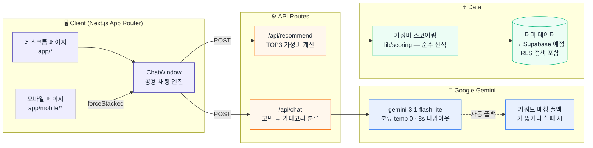
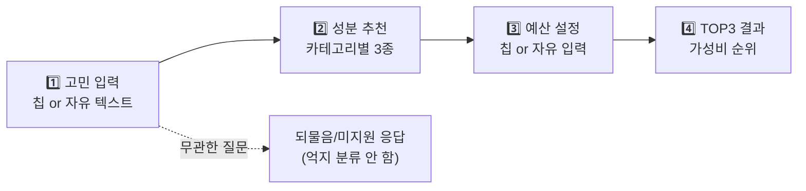
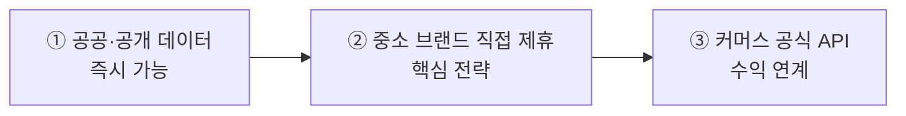
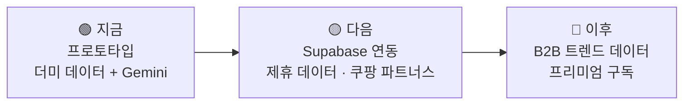

<div align="center">

# 🧪 성분핏 (IngredientFit)

### _광고 말고, 성분으로 고르세요_

전성분 **배치 순서**와 가격을 분석해 가성비 좋은 세럼을 추천하는 **AI 큐레이션 서비스**

<br/>

[](#)
[](#)
[](#)
[](#)
[](#)

<br/>

[📱 기능](#-주요-기능) ·
[🏗️ 아키텍처](#️-아키텍처) ·
[🧮 가성비 계산](#-가성비-점수-계산) ·
[🤖 AI 일관성](#-ai-역할과-일관성-검증) ·
[🗄️ 데이터 전략](#️-데이터-확보-전략) ·
[🔐 보안](#-보안) ·
[⚡ 실행](#-로컬-실행)

</div>

---

## 👥 팀 구성

| 이름 | 역할 | 담당 |
|---|---|---|
| **김문정** | 🎯 PM | 기획 총괄, 일정 관리, 요구사항 정의, 결과 검증 |
| **조창래** | ⚙️ AI/Backend | Gemini 연동, API 라우트, 가성비 스코어링 엔진, 보안(RLS·레이트리밋) |
| **유성미** | 🎨 Frontend | UI/UX, 페이지·컴포넌트 구현, 반응형(데스크톱/모바일) |

---

## 📱 주요 기능

<table>
<tr>
<td width="50%" valign="top">

### 💬 AI 채팅 추천
고민 입력 → 성분 추천 → 예산 설정 → **TOP3 결과**.
카테고리 칩 또는 자유 텍스트("눈가 주름이 고민이에요")
모두 지원, "2만원대" 같은 자유 예산 입력도 자동 파싱.

</td>
<td width="50%" valign="top">

### 🧴 피부타입 맞춤
설문 4문항으로 피부타입(지성/건성/복합·민감도)을 진단.
저장하면 채팅 추천에서 **내 피부에 맞춰 성분 순서를 재정렬**
(안전장치 → 피부타입 순서 고정으로 안전 제외는 유지).

</td>
</tr>
<tr>
<td valign="top">

### 🧮 계산법 투명 공개
"가성비 계산법 보기" 버튼 하나로 공식 + 실제 계산값
(배치/가격/예산 점수)을 `ScoreBar` 애니메이션으로 공개.
**블랙박스 없는 추천**이 핵심 차별점.

</td>
<td valign="top">

### 📸 결과 저장/공유
추천 카드를 `html-to-image`로 PNG 캡처.
모바일은 Web Share API 공유 시트, 데스크톱은 다운로드.

</td>
</tr>
<tr>
<td valign="top">

### 🔍 제품 탐색
채팅 없이도 검색·필터(고민/성분)·정렬(가격/ml당/용량)로
열람. 카드 클릭 시 상세 모달, 없는 제품은
"추가 요청하기" 폼으로 접수.

</td>
<td valign="top">

### ⚖️ 비교함 · ⭐ 즐겨찾기
최대 4개 제품 나란히 비교(카테고리 넘나들며 유지),
즐겨찾기는 로그인 없이 `localStorage` 저장.
점수는 전부 막대그래프로 시각 비교.

</td>
</tr>
<tr>
<td valign="top">

### 📱 모바일 전용 UX
탭 확장형 성분 카드, 스와이프 캐러셀 TOP3,
플로팅 액션 버튼 — 데스크톱 축소판이 아니라
터치 환경에 맞게 재설계.

</td>
</tr>
</table>

---

## 🏗️ 아키텍처



**핵심 설계 — AI는 계산하지 않습니다.** 가성비 점수는 100% 순수 산식(`lib/scoring/calculator.ts`)이 계산하고, AI는 ① 자연어 → 카테고리 분류, ② 계산된 점수를 문장으로 설명, 두 가지만 담당합니다. "그냥 GPT 쓰면 되지 않나?"에 대한 답: GPT는 실제 전성분 배치를 모르니 환각을 냅니다. 성분핏은 **전성분 데이터 기반 계산 엔진 + 자연어 인터페이스**입니다.

### 💬 채팅 플로우



- 대화·조건은 `localStorage` 저장 (`useSyncExternalStore` 기반, 하이드레이션 안전)
- 조건 태그 클릭으로 **해당 단계만** 다시 선택 가능 (전체 재시작 불필요)
- 자극 피부 신호·병용 주의 조합(레티놀+비타민C 등) 감지 시 **코드 레벨 안전장치**(`lib/safety.ts`)가 AI와 무관하게 항상 작동

---

## 🧮 가성비 점수 계산

```
최종 점수 = (전성분 배치 점수 × 0.60) + (ml당 가격 점수 × 0.30) + (예산 점수 × 0.10)
```

### ⚖️ 전성분 기재 순서의 법적 한계와 보정 장치

> **한계를 먼저 명시합니다.** 화장품법 시행규칙상 **함량 1% 이하 성분·착향제·착색제는 순서와
> 무관하게 기재**할 수 있습니다. 이 서비스의 핵심 성분 대부분이 바로 이 구간에 있습니다 —
> 레티놀 통상 0.01~0.3%, 아데노신 기능성 고시 함량 0.04%, 펩타이드류 극미량.

이를 보정하는 장치가 **성분별 기준위치(refPosition)** 입니다:

| 방식 | 평가 기준 | 문제점/장점 |
|---|---|---|
| ❌ 절대 순번 | "몇 번째에 있나" | 1% 이하 구간에서 왜곡 |
| ✅ 상대 배수 | **실제 위치 ÷ 성분별 기준위치** | 성분마다 유효 함량일 때의 통상 위치 기준 (레티놀 12, 아데노신 15, 나이아신아마이드 7…) |

같은 15번째 순번이라도 아데노신이면 기준 안(만점), 나이아신아마이드면 기준의 2배(감점) —
"이 성분치고는 앞/뒤에 있다"는 성분 내 상대 비교라 절대 순번의 왜곡을 상당 부분 흡수합니다.
남는 한계(정확한 함량 추정 불가)는 향후 기능성 고시 함량 공개 정보로 기준위치를 지속 보정할 계획입니다.

---

## 🤖 AI 역할과 일관성 검증

**점수에 영향을 주는 단계는 결정론적으로 고정했습니다.**

| 단계 | 파일 | temperature | 역할 |
|---|---|---|---|
| 고민 → 카테고리 분류 | `lib/gemini/analyzer.ts` | **0 (고정)** | 추천 결과를 좌우 — 재현성 필수 |
| 인사말 생성 | `lib/gemini/intro.ts` | 0.5 | 문장 표현만, 점수 무관 |
| 추천 이유 생성 | `lib/gemini/reasoning.ts` | 0.4 | 계산된 점수를 문장으로 설명만 |

### 🔬 검증 절차: 동일 입력 반복 편차 측정

```bash
npm run dev          # 별도 터미널에서 서버 실행
npm run consistency  # 검증 스크립트 실행
```

`scripts/consistency-check.mjs`가 카테고리별 대표 문장 + 모호한 문장을 여러 번 반복 호출해
문장별 **분류 일치율(%)과 응답 분포**를 표로 출력합니다.

| 통과 기준 | |
|---|---|
| 명확한 문장 | 일치율 **100%** |
| 모호한 문장 | 임의 분류 대신 되물음/미지원으로 **일관 처리** |
| AI 미사용(키워드 폴백) 상태 | 100%여도 검증으로 인정 안 함 (✨/🔤 배지로 구분 표시) |

---

## 🔬 학술적 근거

성분핏의 개인화 설계는 관련 논문 3편에 근거합니다. 상세 매핑은 [`docs/RESEARCH.md`](docs/RESEARCH.md) 참고.

| 성분핏 기능 | 논문 | 개념 |
|---|---|---|
| 피부타입 설문 | Gao 2021 (대화형 추천 서베이) | Question-based Preference Elicitation (attribute 질문) |
| 신규 사용자 대응 | Gao 2021 | Cold-start |
| 프로필을 추천 피처로 | Lin 2023 (LLM×추천 서베이) | User-level Feature Augmentation (KAR/CUP) |
| 👍/👎 피드백 루프 *(설계)* | Gao 2021 | Interactive Rec / Exploitation-Exploration |
| **refPosition 배치 점수** | **CPDat 2018 (EPA 성분 DB)** | 퍼스널케어 함량 내림차순 기재 의무 → 순서로 함량 예측 |
| 데이터 확보(공공 DB) | CPDat 2018 | EPA CompTox 공개 성분·함량 DB |
| AI는 분류·설명만 | Lin 2023 | LLM as Feature Engineering (환각 회피) |

> 💡 **핵심**: 성분핏이 "전성분 기재 순서로 함량을 추정"하는 접근은 EPA 연구진이 CPDat에서
> 실제로 쓴 방법과 같습니다 — *"퍼스널케어 제품은 법적으로 함량 내림차순 기재 의무가 있어,
> 기재 순서에 모델을 적용해 함량을 예측했다"*. 임의 발상이 아니라 학술적으로 검증된 방법론입니다.

---

## 🗄️ 데이터 확보 전략

> **원칙: 크롤링 배제.** 올리브영·쿠팡은 약관상 크롤링 금지 조항(법적 리스크), 화해는 API 미공개.



| 단계 | 경로 | 내용 |
|---|---|---|
| **①** | 식약처 의약품안전나라 | 기능성화장품 심사·보고 정보 (고시 성분·함량의 공식 출처) |
| | 대한화장품협회 성분사전 | 성분 표준명·표기 기준 |
| | 공공데이터포털 | 책임판매업체·품목 신고 정보 |
| **②** | D2C 인디 세럼 브랜드 | 와디즈 뷰티 펀딩 상위 등 성분을 셀링포인트로 내세우는 신생 브랜드 |
| | 자사몰 중심 중소 브랜드 | 플랫폼 수수료 부담 → 자체 유입 채널 원함 |
| | OEM/ODM 경유 신생 브랜드 | 한국콜마·코스맥스 제조 — 품질은 검증, 인지도가 낮은 곳 |
| **③** | 쿠팡 파트너스 오픈 API | 약관 위반 없는 **공식 API** + 구매 전환 시 제휴 수익 |
| | 네이버 쇼핑 검색 API | 가격 비교·품절 보조 데이터 |

**② 제휴 교환 구조**: 브랜드가 전성분·가격 데이터 제공 ↔ 우리는 "성분 투명성" 배지 + 추천 노출 제공.
보조로 사용자 전성분 사진 제보(검수 후 반영) 크라우드소싱도 병행합니다.

---

## 🔐 보안

| 항목 | 구현 |
|---|---|
| 🛡️ Supabase RLS | 전 테이블 Row Level Security — 카탈로그는 읽기 전용, 상담 기록은 본인만 (`lib/supabase/schema.sql`) |
| 🚧 레이트리밋 | IP당 분당 20회, 초과 시 429 (`lib/rateLimit.ts`) — AI 비용 남용 방지 |
| ✂️ 입력 검증 | 고민 텍스트 500자 상한, 잘못된 JSON/예산값 400 거절 |
| 🔑 API 키 보호 | Gemini 키를 쿼리스트링 대신 `x-goog-api-key` 헤더로 전송 (Google 권장) |
| ⏱️ 타임아웃 | Gemini 호출 8초 제한 → 초과 시 즉시 폴백 (매달림 방지) |
| 🧯 안전장치 | 자극 성분 순위 강등·병용 주의 경고는 AI와 무관하게 코드로 항상 체크 |

---

## 🛠️ 기술 스택

| 영역 | 기술 |
|---|---|
| **Framework** | Next.js 16 (App Router, Turbopack) + React 19 |
| **Styling** | Tailwind CSS 4 + 디자인 토큰(웹·모바일 공유) |
| **AI** | Google Gemini `gemini-3.1-flash-lite` (404 시 `gemini-flash-latest` 자동 폴백 → 키워드 매칭 최종 폴백) |
| **Font** | Pretendard 다이나믹 서브셋 (쓰는 글자만 로드) + Gmarket Sans |
| **Data** | 더미 데이터 (프로토타입) → Supabase PostgreSQL (스키마·RLS 준비 완료) |
| **저장소** | `localStorage` (대화·비교함·즐겨찾기 — 로그인 없이 동작) |
| **기타** | `html-to-image` (카드 캡처), UA 기반 모바일 리다이렉트 (`middleware.ts`) |
| **의존성** | 런타임 5개뿐 (`next` · `react` · `react-dom` · `@supabase/supabase-js` · `html-to-image`) |

---

## 🔌 API 엔드포인트

> 응답 실패 시 `{ error }` + 상태코드 (400/429/500)

| Method | Path | 설명 |
|---|---|---|
| `POST` | `/api/chat` | 고민 텍스트 → 카테고리 분류 + 성분 목록 + AI 인사말 (500자 제한) |
| `POST` | `/api/recommend` | 성분+예산 → 가성비 TOP3 (`{ ingredient, budget, results }`) |

두 라우트 모두 **Mock API 겸용 설계** — 응답 shape를 유지한 채 데이터 소스만 더미 → Supabase로 교체하면 프론트 수정이 거의 없습니다.

---

## 📁 프로젝트 구조

<details open>
<summary><b>🌳 전체 트리</b></summary>

```
seongbunfit/
│
├── 📄 app/                        Next.js App Router
│   ├── page.tsx                   랜딩 (데스크톱)
│   ├── chat/                      AI 채팅 추천
│   ├── products/                  제품 탐색 (검색·필터·정렬)
│   ├── skin-profile/              피부타입 진단 설문
│   ├── faq/ · notice/ · terms/ · contact/ · event/
│   ├── mobile/                    📱 모바일 전용 트리 (위 페이지들과 1:1 대응)
│   ├── globals.css                디자인 토큰 + 애니메이션 (웹·모바일 공용)
│   └── api/
│       ├── chat/route.ts          분류 API (레이트리밋·입력검증)
│       └── recommend/route.ts     추천 API
│
├── 🧩 components/
│   ├── chat/                      ChatWindow · IngredientCard · ResultCarousel
│   │                              CompareModal · FavoritesModal · ScoreExplainer …
│   ├── product/                   ResultCard · ProductDetailModal
│   ├── mobile/                    MobileHeader · MobileDrawer
│   ├── ui/                        Button · Modal
│   ├── ScoreBar.tsx · ScoreDonut.tsx   공용 점수 시각화
│   └── …                          랜딩/공용 컴포넌트
│
├── 📚 lib/
│   ├── scoring/calculator.ts      💰 가성비 산식 (60/30/10)
│   ├── gemini/                    analyzer(분류) · intro(인사말) · reasoning(추천 이유)
│   ├── safety.ts                  자극 성분·병용 주의 안전장치
│   ├── skinProfile.ts             피부타입 설문·판정·성분 재정렬
│   ├── rateLimit.ts               IP 레이트리밋
│   ├── ingredients.ts             성분 데이터 + refPosition
│   ├── products.ts · budgets.ts   더미 제품 · 예산 구간
│   ├── useLocalStorage.ts         useSyncExternalStore 기반 저장 훅
│   └── supabase/                  client.ts · schema.sql (RLS 포함)
│
├── 🖼️ public/
│   ├── icons/                     서비스 4단계 아이콘 (StepIcon이 동적 로드)
│   ├── images/                    히어로 배경 · 제품 플레이스홀더
│   └── logo/                      logo_color.png
│
├── 🔬 scripts/
│   └── consistency-check.mjs      AI 분류 일관성 검증 (npm run consistency)
│
├── 📖 docs/
│   ├── FEEDBACK.md                교수님 피드백 반영 정리
│   └── RESEARCH.md                논문 기반 학술적 근거 매핑
│
└── middleware.ts                  모바일 UA → /mobile/* 리다이렉트
```

</details>

> 🧹 미사용 컴포넌트·자산·의존성은 정리된 상태입니다. 런타임 의존성은
> **`next` · `react` · `react-dom` · `@supabase/supabase-js` · `html-to-image` 5개**뿐이라
> `npm install`이 가볍고, `public/` 에도 실제 화면에 쓰이는 파일만 남아 있어요.

---

## ⚡ 로컬 실행

```bash
npm install
npm run dev
```

브라우저에서 http://localhost:3000 접속

### 🤖 Gemini 연동 (선택)

1. https://aistudio.google.com/apikey 에서 키 발급 (신용카드 불필요, 무료 티어)
2. 루트에 `.env.local` 생성:
   ```env
   GEMINI_API_KEY=AIza...
   ```
3. `npm run dev` 재시작 — 끝. 키가 없으면 키워드 매칭으로 자동 폴백돼요.

> 💡 Gemini 사용 여부는 채팅 말풍선 옆 배지(✨ Gemini / 🔤 키워드 매칭)와 터미널 로그로 확인할 수 있어요.

<details>
<summary><b>🌱 환경변수 전체</b></summary>

```env
# ───── AI (선택 — 없으면 키워드 폴백) ─────
GEMINI_API_KEY=AIza...

# ───── Supabase (선택 — 없으면 더미 데이터) ─────
NEXT_PUBLIC_SUPABASE_URL=https://<ref>.supabase.co
NEXT_PUBLIC_SUPABASE_ANON_KEY=<anon-key>

# ───── 개발용 (선택) ─────
MOCK_LATENCY_MS=2000    # 로딩 상태 테스트용 인위적 지연
```

</details>

---

## 🗺️ 로드맵



| 단계 | 수익 모델 |
|---|---|
| 1️⃣ 즉시 | 쿠팡 파트너스 (구매 링크 제휴 수익) |
| 2️⃣ 6개월 내 | B2B 성분 트렌드 데이터 판매 |
| 3️⃣ 장기 | 프리미엄 구독 |

---

## ⚠️ 주의사항

| 🚨 | 내용 |
|---|---|
| 🔐 | `.env.local` **절대 커밋 금지** (gitignore 처리됨) — Gemini 키 노출 시 즉시 재발급 |
| 🧪 | 더미 제품 데이터의 `actualPosition`은 프로토타입용 예시값 — 실제 연동 시 재입력 |
| ⚖️ | 서비스 결과는 의료 진단이 아니며, 채팅 진입 시 면책 동의 모달을 거칩니다 |
| 📊 | AI 일관성 검증(`npm run consistency`)은 `GEMINI_API_KEY`가 있는 환경에서 실행해야 유효합니다 |

> 📜 상세 개발 이력·버그 픽스 기록은 git 히스토리, 교수님 피드백 반영 내역은 [`docs/FEEDBACK.md`](docs/FEEDBACK.md) 참고.

---

<div align="center">

### 🧪 성분핏 Team

_김문정 · 조창래 · 유성미_

_Made with Next.js ▲ + Google Gemini ✨_

<sub>© 2026 IngredientFit</sub>

</div>
